# FoodMood

To overcome the limitations of above system, we have developed an Online Food ordering system (Food Mood). To develop a reliable, convenient, user-friendly and accurate Food ordering system is considered as an objective.
The system is also convenient for the seller (who is actually a common housewife)
as she can sell her dish online who is unaware of high technology and is not very educated.
Even she can handle the system efficiently. This is system is developed in a very simple language
which a user can handle very efficiently. He does not need to be highly professional.
Registration process is very easier for the user (seller/user/delivery boy).

# Screenshots

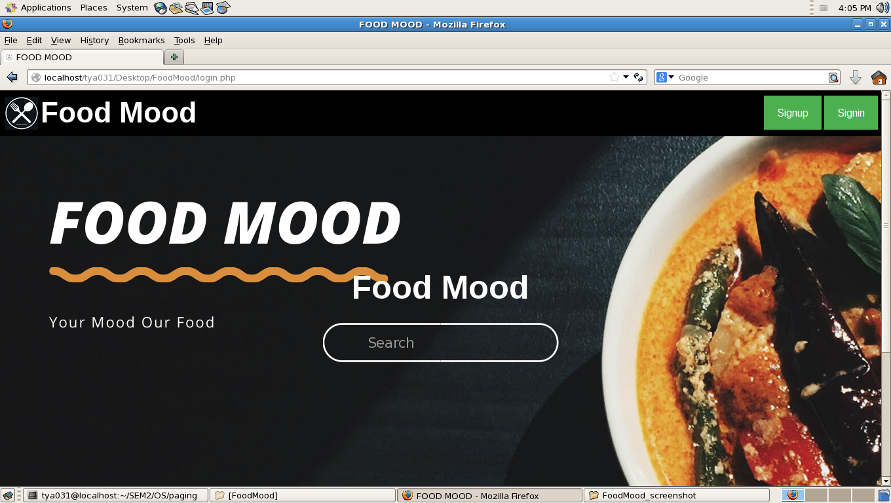
 
 
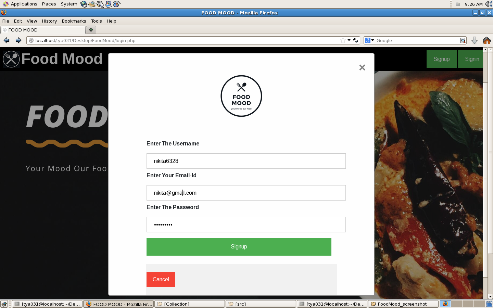
 
 
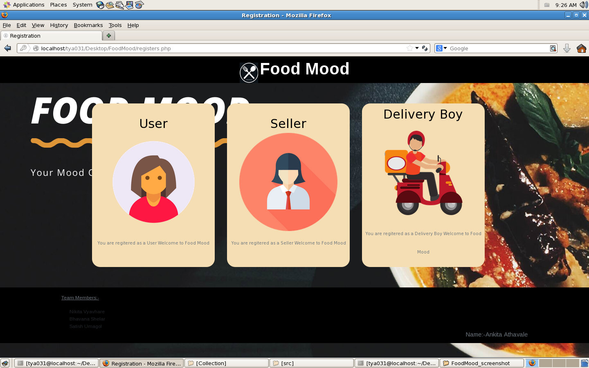
 
 
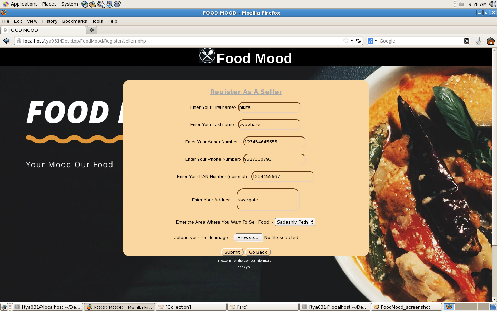
 
 
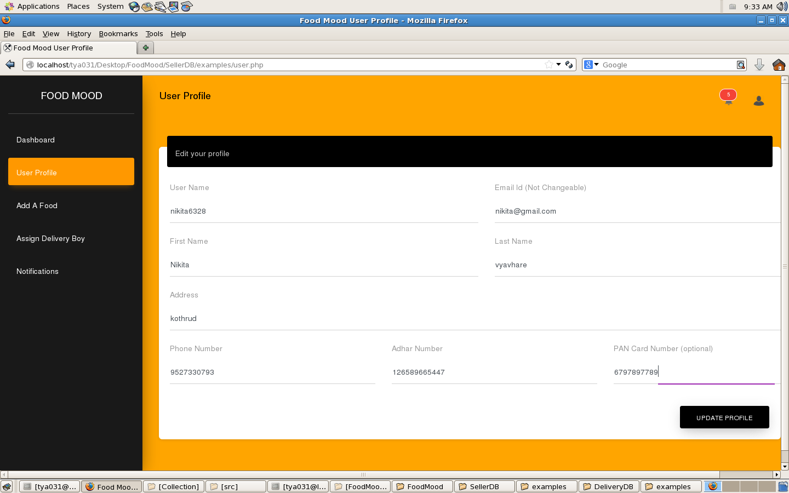
 
 
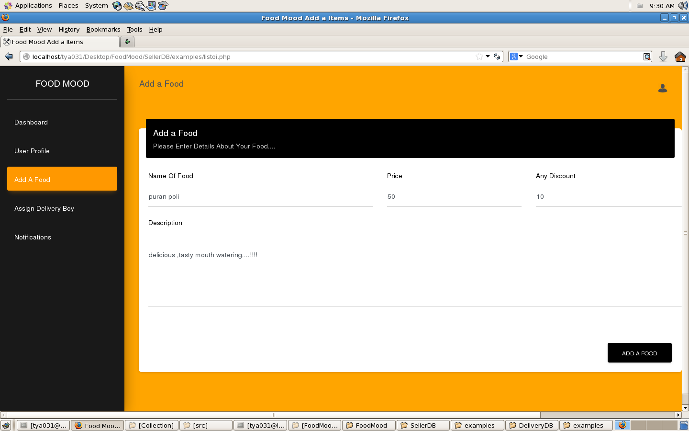
 
 
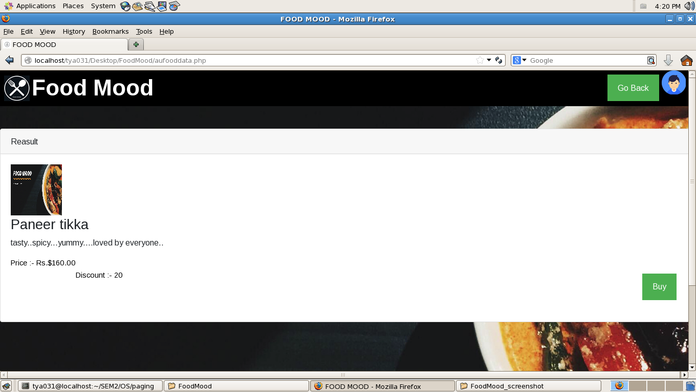
 
 
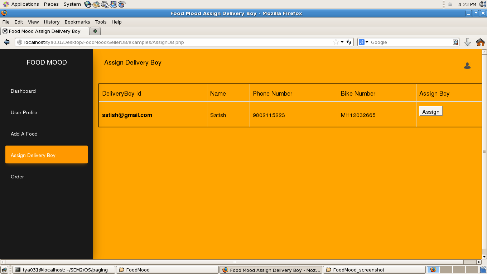
 
 
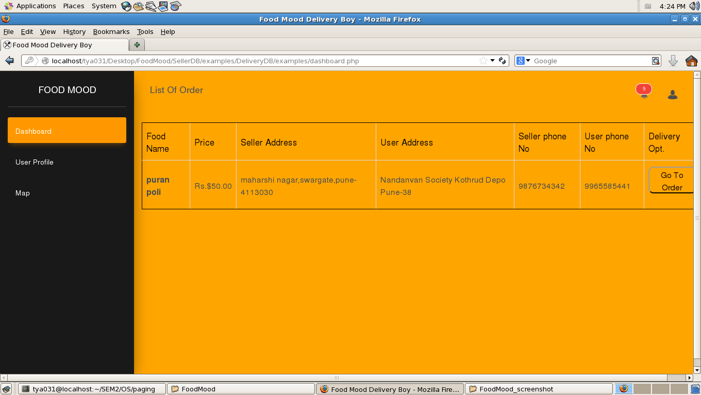
 
 
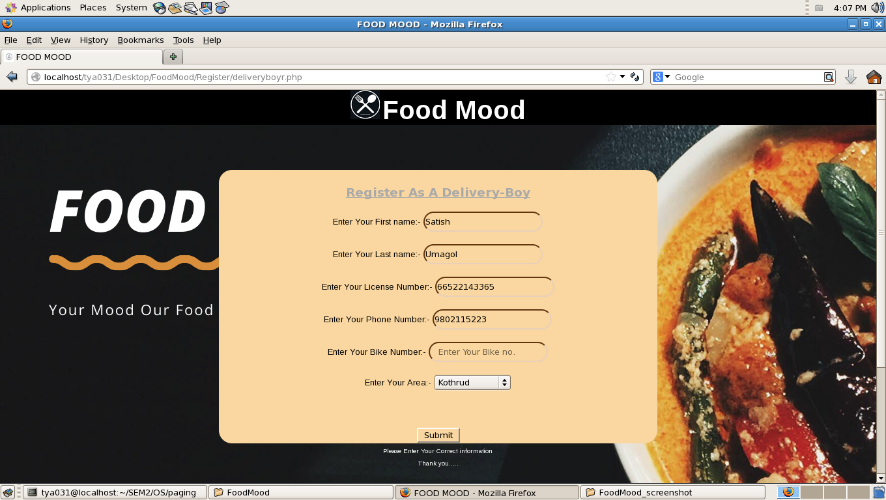
 
 
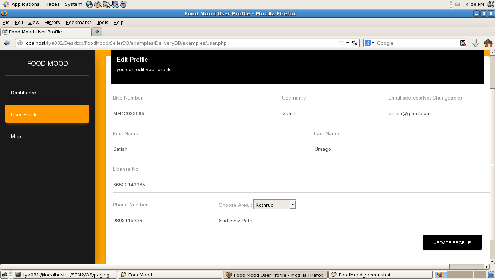
 
 
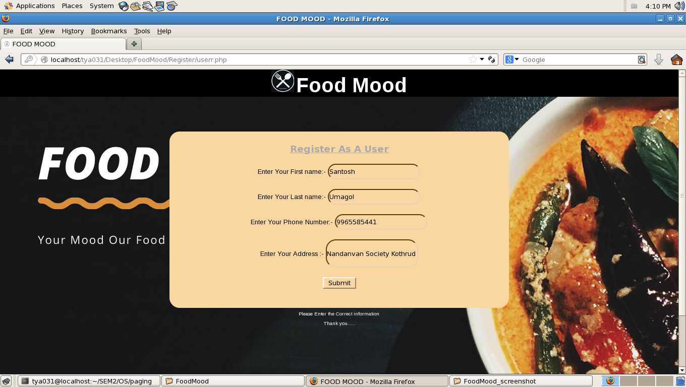
 
 
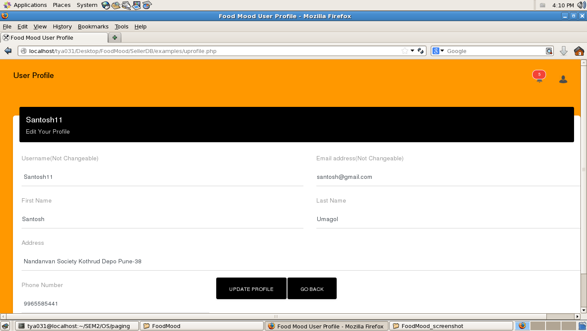
 
 
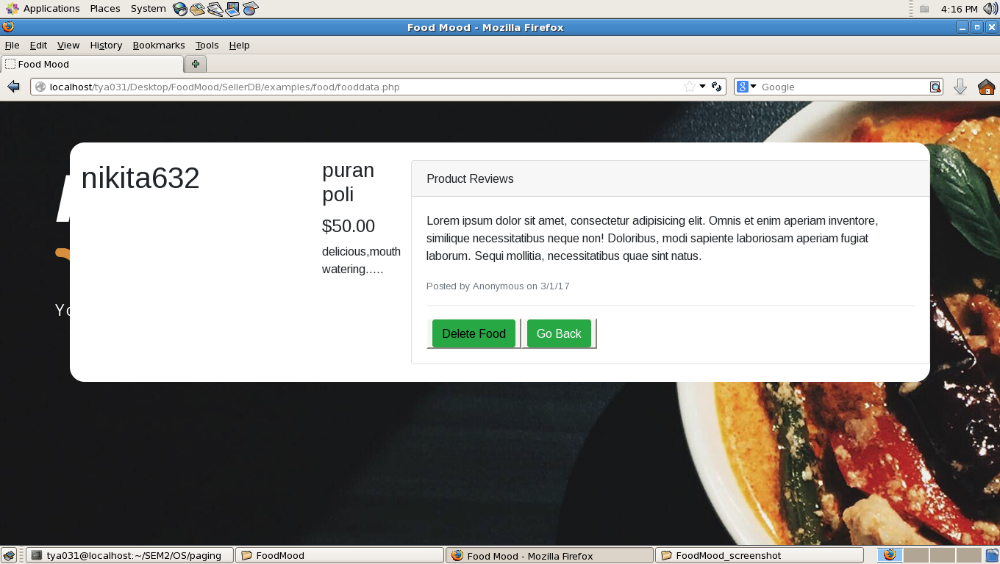
 
 
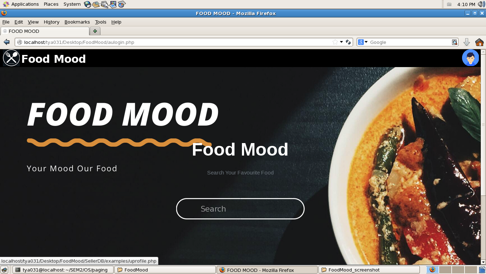
 
 
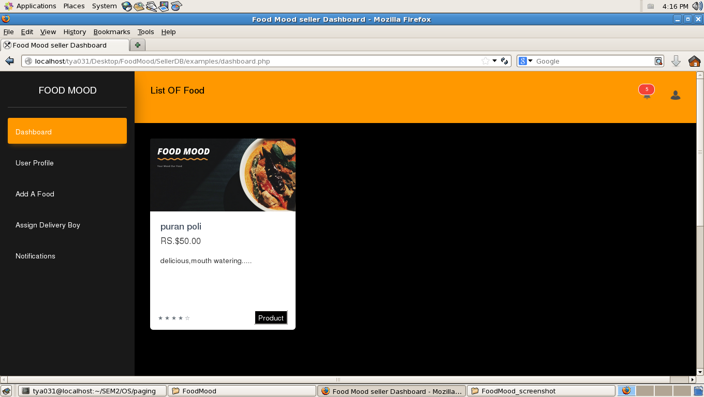
 
 

 
 
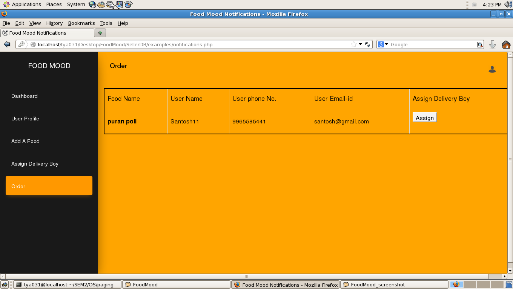